# Subscan Multisig UI - React

Subscan Multisig UI is a web Multisignature management tool. It's developed by the Subscan team.
Developers are free to use the codebase to extend functionalities and develop unique user experiences for their audiences.

The backend project stores historical calls can be found [here](https://github.com/itering/subscan-multisig-backend), and call data retrieved will be parsed and verified on the frontend.

This is a React-rewrite of previous Vue [implementation](https://github.com/itering/subscan-multisig-ui).

## Contents

- [Feature](#Feature)
- [Tutorial](#Tutorial)
- [Integration](#Integration)
- [QuickStart](#QuickStart)
  - [Requirement](#Requirement)
  - [Installation](#Install)
  - [Test](#Test)
- [Contributions](#Contributions)
- [LICENSE](#LICENSE)
- [Resource](#Resource)

## Feature

1. Create multi-signature account and send extrinsic
2. Manage multi-signature wallets and extrinsic
3. Support multiple networks that are based on Substrate development
4. User-friendly UI

## Tutorial

### Prerequisites

#### 1.Install chrome extension polkadot.js

This application will not save your account's private key. All extrinsics initiated will be signed through the polkadot.js extension. Make sure you have installed the polkadot.js extension and created an account in it.

[Download link](https://chrome.google.com/webstore/detail/polkadot%7Bjs%7D-extension/mopnmbcafieddcagagdcbnhejhlodfdd)

<p align="center">
  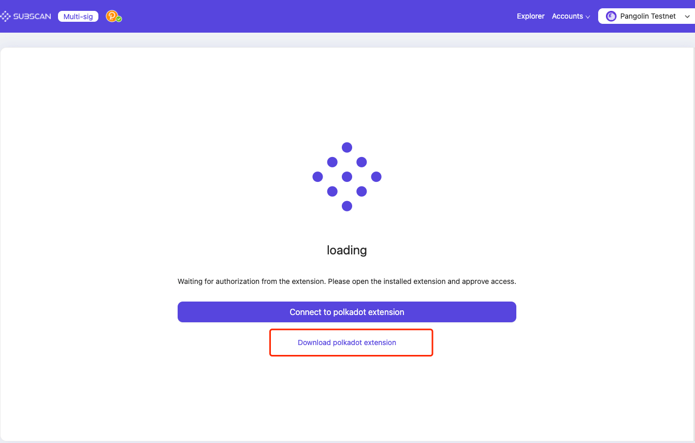
</p>

#### 2.Authorize chrome extension polkadot.js

If you have installed the polkadot.js extension, you will be automatically connected when you enter the page. Please authorize SUBSCAN_Multisig access.

<p align="center">
  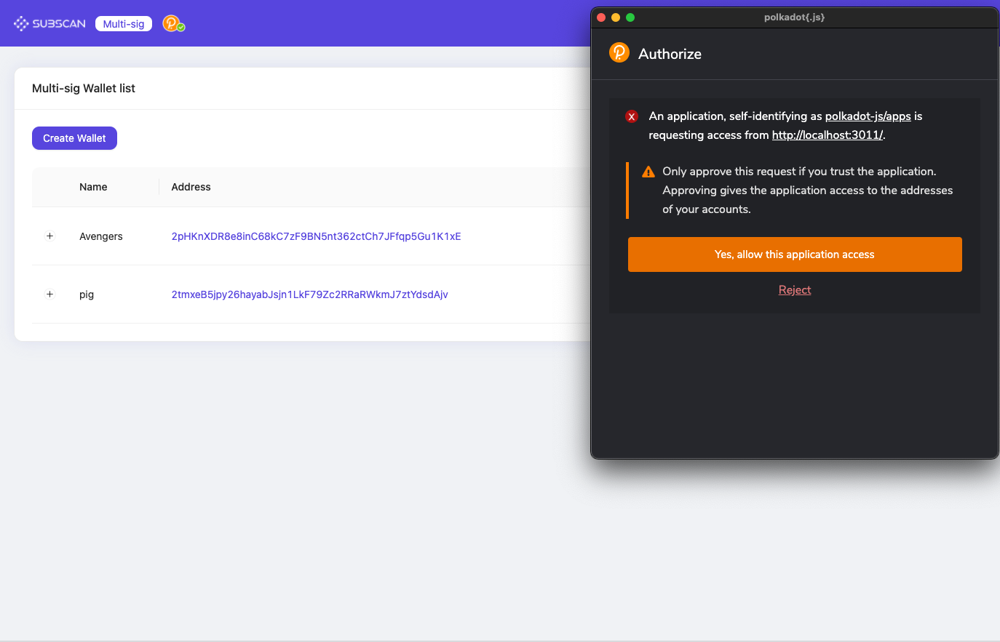
</p>

### Manage multi-sig accounts

#### 1.Create/Add multi-sig accounts

- Click "Create Wallet"
  <p align="center">
    
  </p>
- Fill in the required form data for a multi-sig account. Click "Create" to proceed.

  \*Name: The name/label of this multi-signature account. It is stored locally on your computer only.

  \*Threshold: The minimum number of approved members required for each extrinsic to be executed. The minimum input value is 2.

  \*Members: Participating members of a multi-signature account. The minimum number is 2 and the maximum number is 100.

  <p align="center">
    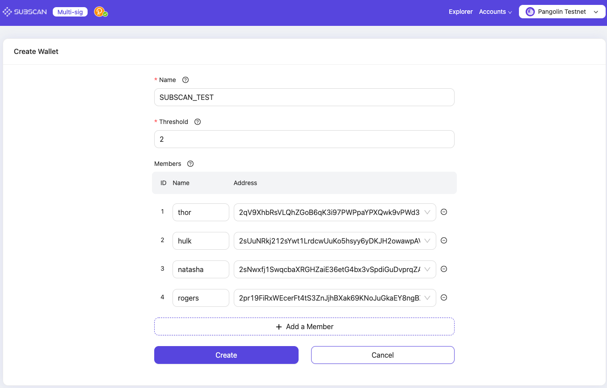
  </p>

#### 2.Manage multi-sig accounts

- View the members of multi-sig account
  <p align="left">
    Click
    
    to show/hide the members of the multi-sig account (include remark name, account, status)
  </p>

  \*Injected account: The account existing in the local polkadot.js extension can be used for signing.

  \*External account: The account that does not exist in the local polkadot.js extension and cannot be used for signing.

  <p align="center">
    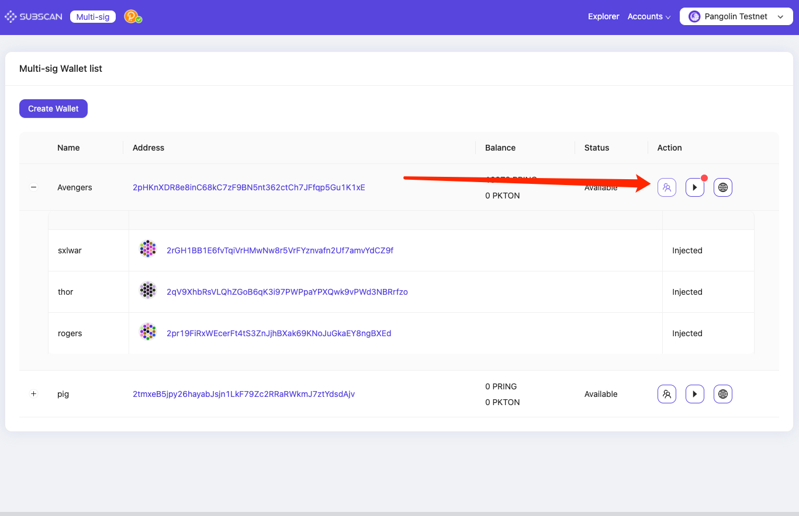
  </p>

- Manage multi-sig accounts
  <p align="left">
    1. Click
    
    to enter multi-sig account details
  </p>

  <p align="center">
    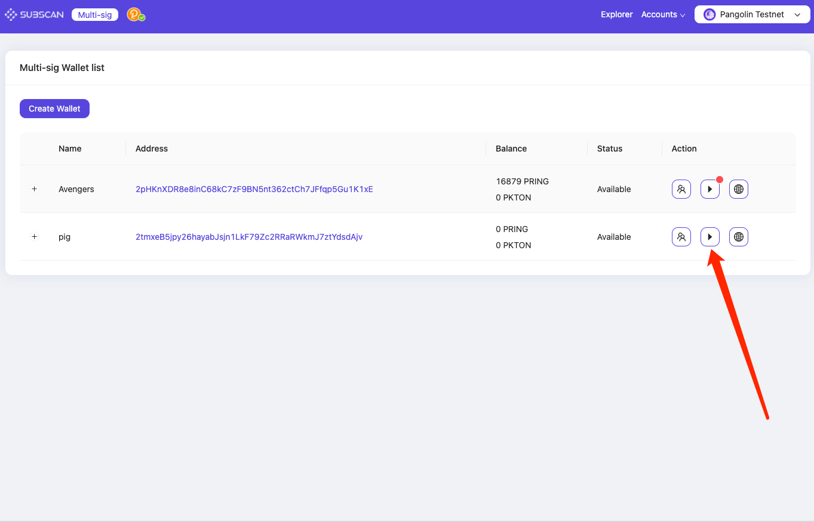
  </p>

  <p align="left">
    2. In the multi-sig account details, you can either edit the wallet name or delete the wallet by click the correspond icon.
  </p>

  <p align="center">
    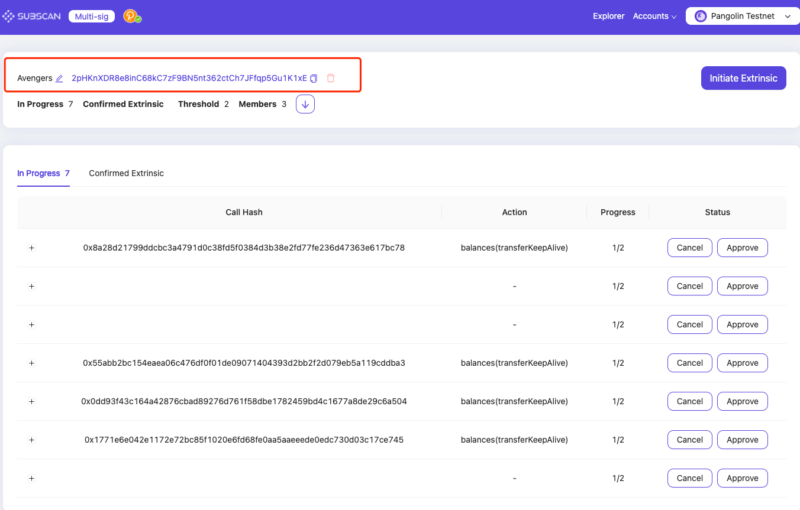
  </p>

### Multi-sig transfer

#### 1.Perform a Multi-sig balance transfer

Click "Initiate extrinsic," enter the parameters, choose the submission method you want, click the corresponding button to submit

The member account that initiates the multi-sig transfer needs to hold a few token balance to pay for the network fees. Otherwise, the extrinsic will fail, and an error of "LiquidityRestrictions" will be raised.

  <p align="center">
    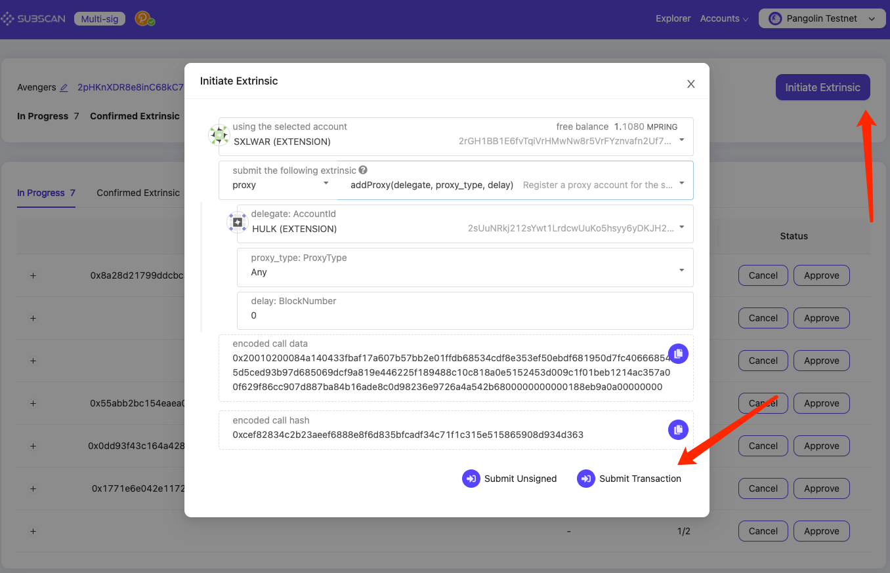
  </p>

#### 2.Authorize a multi-sig transfer

- <p align="left">
    As shown in the figure,
    
    a red badge on the button indicates there is at least one pending transaction in this wallet.

  </p>

  <p align="center">
    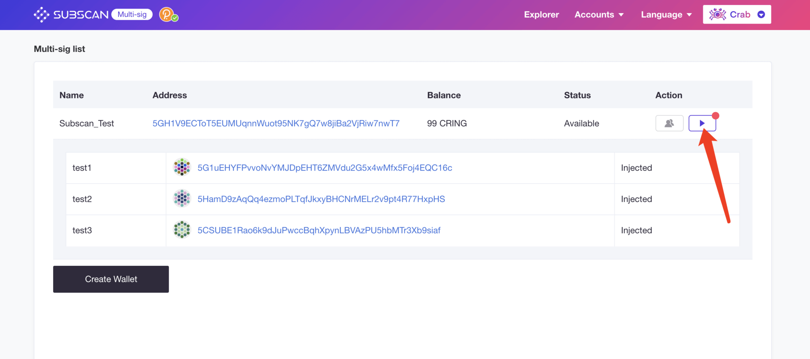
  </p>

- Click to view the multi-signature account details. After confirming that the extrinsic call data is correct, click "Approve" and approve the extrinsic.

  \*For externally initiated extrinsics, call data may not be stored on the chain or in the database. Therefore, in the last "approved" extrinsic, you need to manually fill in the call data.

    <p align="center">
      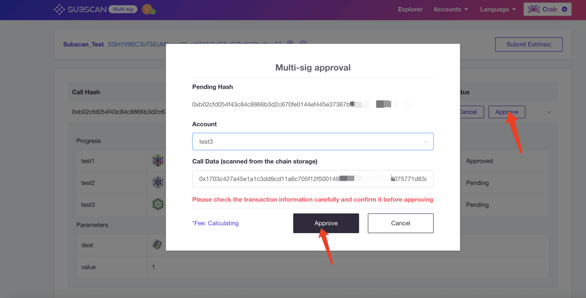
    </p>

- When the number of approvals reaches the threshold, the extrinsic will be executed.
    <p align="center">
      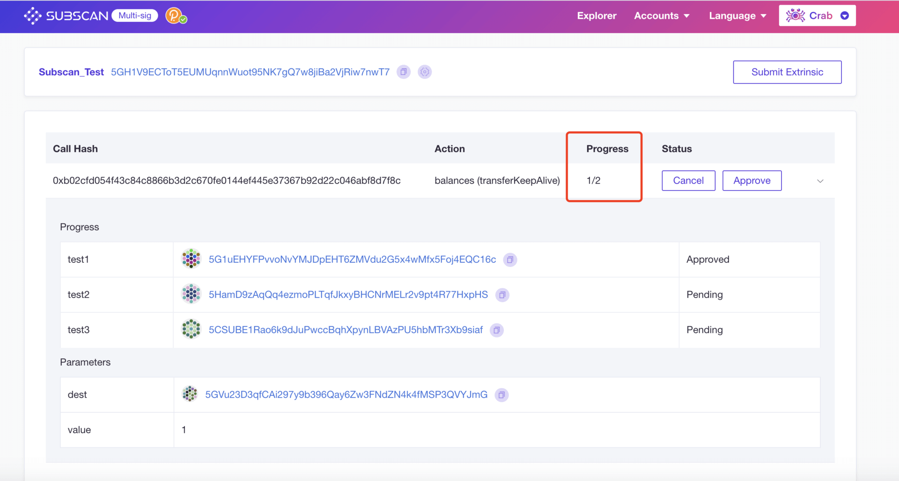
    </p>

#### 3.Cancel multi-sig transfer

Only the initiator has the authority to cancel the multi-sig extrinsic. Click "Cancel" and sign the extrinsic to cancel.

  <p align="center">
    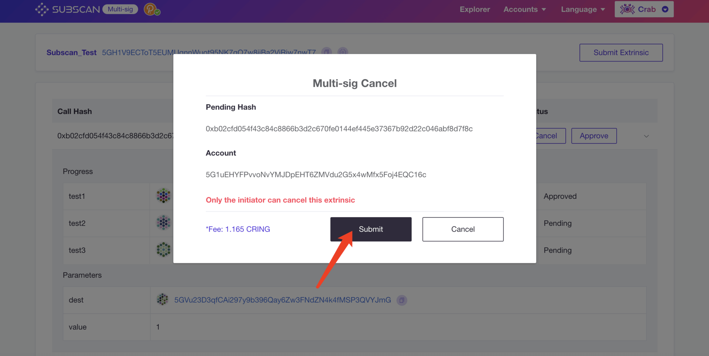
  </p>

## Integration

### Add your own network in supported network list

#### 1.Write your network config file

All networks are configured in `src/config/chains` folder, You can take `polkadot.json` as an exmaple:

```
{
  "name": "polkadot",
  "displayName": "Polkadot",
  "rpc": "wss://rpc.polkadot.io",
  // Optional (Delete this line in PR!)
  "api": {
    "subql": "https://api.subquery.network/sq/itering/multisig_polkadot__aXRlc"
  },
  "logo": "/image/polkadot-button-mobile.png",
  // Optional (Delete this line in PR!)
  "explorerHostName": "polkadot",
  "themeColor": "#e6007a"
}
```

#### 2.Make a PR to submit your network

After completing the above json config file, you can place it under `src/config/chains`, and submit a PR targeting `master` branch, once it's approved, multisig APP will display your network in the list.

  <p align="center">
    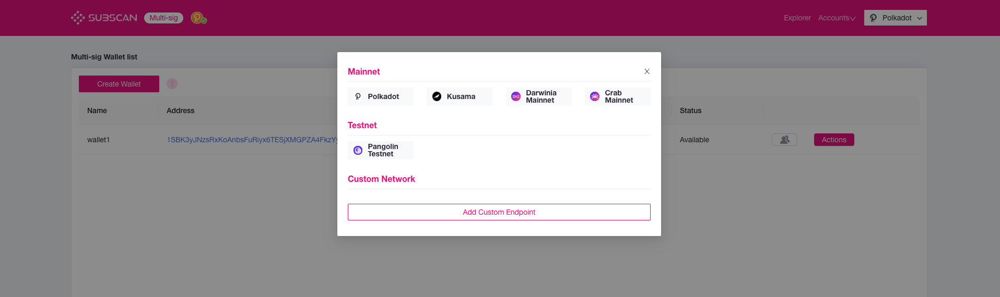
  </p>

#### 3.Deploy your own subquery endpoint (optional)

In order to support advanced features such as transaction history, you need to deploy your own [subquery](https://doc.subquery.network/) endpoint, and add it to the json file above.
You can fork from the [subscan multisig subquery repo](https://github.com/itering/subql-multisig) and add support for your network.

## QuickStart

### Requirement

- Linux / Mac OSX
- Git
- yarn / npm
- Node 14.15.x

### Install

```bash
yarn && yarn start:dev
```

### Test

```bash
//unit
yarn test:unit
//e2e
yarn test:e2e

```

## Contributions

We welcome contributions of any kind. Issues labeled can be good (first) contributions.

## LICENSE

[](https://opensource.org/licenses/Apache-2.0)

## Resource

- [ITERING] <https://github.com/itering>
